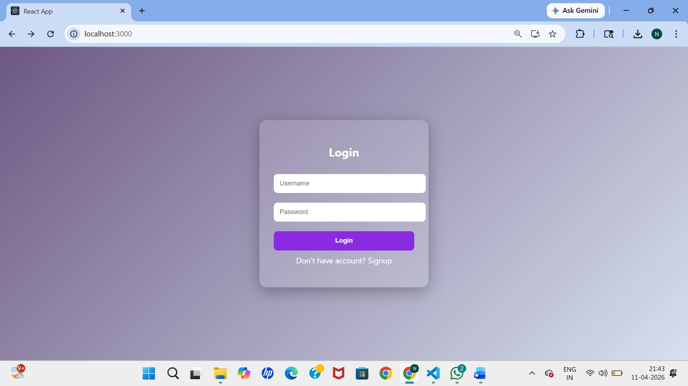
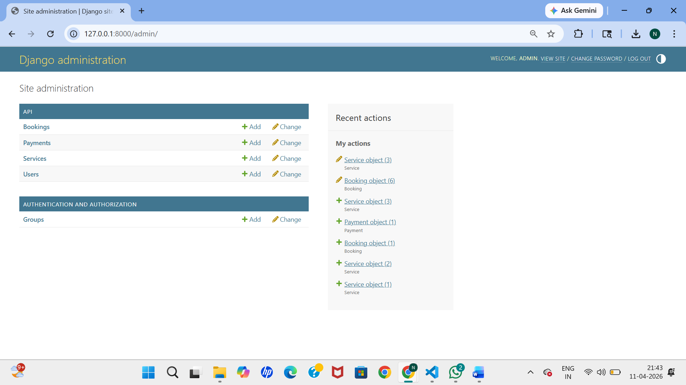
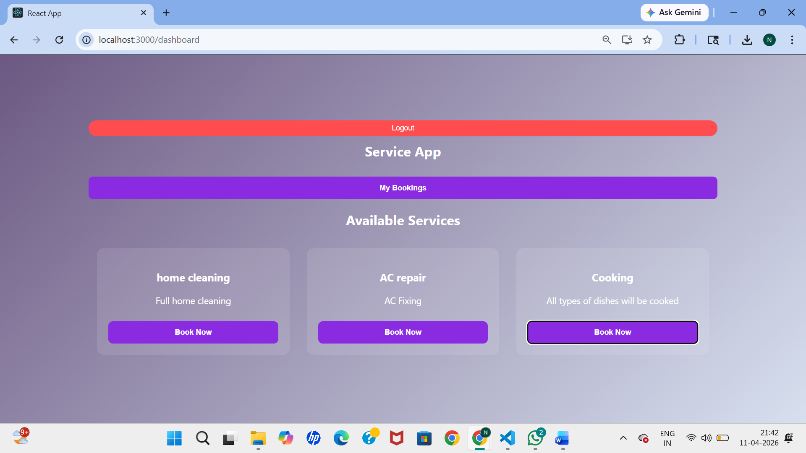

# Smart Service Booking System

A full stack web application developed using Django and React.

## 🚀 Features
- User Registration & Login (JWT Authentication)
- View Available Services
- Book Services
- View Bookings
- Admin Panel for Service Management

## 🛠 Tech Stack
- Backend: Django, Django REST Framework
- Frontend: React.js, JavaScript
- Database: SQLite
- Authentication: JWT

## 📸 Screenshots

### 🔐 Login Page

### 📊 Dashboard

### 📦 Booking Page

## ▶️ Run Project

### Backend
cd backend  
venv\Scripts\activate  
python manage.py runserver  

### Frontend
cd frontend  
npm install  
npm start  
